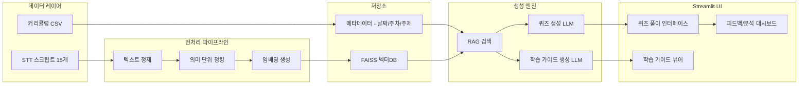

# AI 복습 퀴즈 & 학습 가이드 생성기 구현 플랜

## 개요

STT 강의 스크립트 15개와 커리큘럼 CSV를 기반으로, RAG 파이프라인을 통해 다양한 유형의 복습 퀴즈와 주차별 학습 가이드를 자동 생성하고, Streamlit UI로 퀴즈 풀이/피드백을 제공하는 시스템을 구축한다.

---

## 데이터 현황 분석

- **강의 스크립트**: 15개 STT 텍스트 파일 (`<시간> 화자ID: 발화내용` 형식), 일자별 약 1,000~1,500줄
- **커리큘럼**: CSV 파일 (week, date, session, subject, content, learning_goal 등 31행)
- **퀴즈 샘플**: docx 참고용 (4지/5지선다, 문항+보기+정답 구조)
- **주의**: 커리큘럼은 객체지향/프론트엔드/백엔드 주제이나, 실제 스크립트는 Java I/O, MySQL/SQL, 뷰/프로시저/트리거/인덱싱 등 DB 중심 내용이 많음 → 스크립트 내용 기반으로 퀴즈를 생성해야 함

---

## 기술 스택

- **LLM**: OpenAI GPT-4o API (퀴즈/해설/학습가이드 생성)
- **임베딩**: OpenAI text-embedding-3-small / 로컬 sentence-transformers (한글, API 없이 사용 가능)
- **벡터DB**: FAISS (로컬, 가볍고 빠름)
- **웹 UI**: Streamlit (퀴즈 풀이에 적합한 상태 관리)
- **데이터 처리**: Python, pandas
- **출력**: JSON (퀴즈 세트), Markdown/PDF (학습 가이드)

---

## 아키텍처 개요



---

## 프로젝트 디렉토리 구조

```
create_quiz_guide/
├── app.py                    # Streamlit 메인 앱
├── requirements.txt
├── .env                      # OPENAI_API_KEY
├── config.yaml               # 하이퍼파라미터/설정
├── src/
│   ├── __init__.py
│   ├── preprocessing.py      # STT 텍스트 정제 및 청킹
│   ├── embeddings.py         # 임베딩 생성 및 FAISS 인덱싱 (OpenAI/로컬 선택)
│   ├── rag.py                # RAG 검색 파이프라인
│   ├── quiz_generator.py     # 퀴즈 생성 엔진
│   ├── guide_generator.py    # 학습 가이드 생성 엔진
│   ├── feedback.py           # 정답/오답 피드백 및 취약 영역 분석
│   └── prompts.py            # 프롬프트 템플릿 모음
├── data/
│   ├── vectorstore/          # FAISS 인덱스 저장 (한글 경로 시 임시 디렉터리 사용)
│   └── generated/            # 생성된 퀴즈/가이드 캐시
├── 강의 스크립트/             # (기존) STT 파일 15개
├── 강의 커리큘럼.csv          # (기존) 커리큘럼
└── pages/
    ├── 1_퀴즈_풀기.py         # Streamlit 멀티페이지: 퀴즈
    ├── 2_학습_가이드.py       # Streamlit 멀티페이지: 학습 가이드
    └── 3_학습_분석.py         # Streamlit 멀티페이지: 취약 영역 분석
```

---

## 모듈별 상세 설계

### 1. 전처리 모듈 (`src/preprocessing.py`)

STT 스크립트의 노이즈를 제거하고 의미 단위로 청킹:

- 타임스탬프(`<HH:MM:SS>`)와 화자ID(`b54f46b0:`) 제거
- 연속 발화를 시간 간격 기준(예: 30초 이상 gap)으로 세그먼트 분리
- 각 세그먼트를 약 500~800 토큰 단위로 오버랩 청킹 (overlap 100 토큰)
- 커리큘럼 CSV와 날짜 매핑하여 각 청크에 `{date, week, subject, content, learning_goal}` 메타데이터 부착

### 2. 임베딩 및 벡터DB (`src/embeddings.py`)

- **OpenAI**: `text-embedding-3-small`로 각 청크 임베딩 생성
- **로컬**: `sentence-transformers/paraphrase-multilingual-MiniLM-L12-v2` (한글 지원, API 불필요)
- config의 `embedding_backend`로 "openai" / "local" 선택
- FAISS `IndexFlatIP` (내적 기반), L2 정규화 후 인덱싱
- 메타데이터는 JSON으로 저장, 인덱스와 1:1 매핑
- Windows 한글 경로 시 FAISS 호환을 위해 임시 디렉터리(ASCII 경로)에 인덱스 저장

### 3. RAG 검색 (`src/rag.py`)

- 사용자가 선택한 날짜/주차/주제에 해당하는 청크를 메타데이터 필터링
- 필터링된 청크 풀에서 FAISS 유사도 검색으로 top-k (k=5~10) 검색
- 검색된 컨텍스트를 LLM 프롬프트에 주입

### 4. 퀴즈 생성 엔진 (`src/quiz_generator.py`)

지원 퀴즈 유형 4가지:

- **객관식 (4지/5지선다)**: 정답 1개 + 오답 보기 (그럴듯한 오답 생성)
- **주관식 (단답형)**: 핵심 개념/용어를 묻는 짧은 답변형
- **빈칸 채우기**: 핵심 문장에서 키워드를 빈칸으로 처리
- **코드 실행**: SQL 쿼리나 Java 코드 결과를 묻는 문제

각 문항 생성 시 포함 필드:

```python
{
    "id": int,
    "type": "multiple_choice" | "short_answer" | "fill_blank" | "code",
    "difficulty": "easy" | "medium" | "hard",
    "question": str,
    "options": list[str] | None,   # 객관식만
    "answer": str,
    "explanation": str,            # 해설
    "source_date": str,            # 출처 강의 날짜
    "topic": str                   # 관련 주제
}
```

난이도 조절 로직:

- **easy**: 정의, 용어, 기본 개념
- **medium**: 비교, 차이점, 적용 시나리오
- **hard**: 복합 개념, 코드 분석, 실무 적용

### 5. 학습 가이드 생성 (`src/guide_generator.py`)

- **주차별 핵심 요약**: 해당 주차 전체 스크립트를 요약 (계층적 요약: 일별 요약 → 주차 요약)
- **핵심 개념 리스트**: 주요 용어/개념을 정의와 함께 추출
- **복습 포인트**: 중요도 순으로 복습해야 할 항목 리스트
- **개념 간 관계**: 개념 맵 형태의 텍스트 (Mermaid 다이어그램으로 시각화 가능)

### 6. 프롬프트 설계 (`src/prompts.py`)

퀴즈 유형별, 난이도별 프롬프트 템플릿을 분리 관리:

- 시스템 프롬프트: 역할 정의 (교육 콘텐츠 전문가)
- 퀴즈 생성 프롬프트: 유형별 지시사항 + 출력 JSON 스키마
- 학습 가이드 프롬프트: 요약/개념 추출/관계 분석용
- Few-shot 예시: 퀴즈 샘플 문서 형식 참고

### 7. 정답 판별 (`src/feedback.py`)

- **객관식**: 사용자 선택과 정답 문자열 완전 일치 (대소문자 무시)
- **주관식/빈칸**: 완전 일치, 포함 관계, 단어 겹침 70% 이상 시 정답
- **복수 항목 정답**(쉼표 등 구분): 정답이 2개 이상 항목이면 **모든 항목이 사용자 답에 포함**될 때만 정답 (일부만 쓴 경우 오답 처리)

### 8. Streamlit UI

**메인 페이지 (`app.py`)**:

- 프로젝트 소개, 벡터DB 구축 버튼, 날짜/주차/과목 수 메트릭, 강의 일정 테이블

**퀴즈 풀기 (`pages/1_퀴즈_풀기.py`)**:

- 날짜/주차/주제 선택 → 퀴즈 유형 및 난이도 선택 → 문항 수 설정
- 한 문항씩 풀이 (radio button / text input)
- 제출 후 즉시 정답/해설 표시
- 전체 결과 요약 (점수, 정답률)

**학습 가이드 (`pages/2_학습_가이드.py`)**:

- 주차별 / 날짜별 보기 모드 선택
- 핵심 요약, 개념 리스트, 복습 포인트 표시
- Mermaid 다이어그램으로 개념 관계 시각화

**학습 분석 (`pages/3_학습_분석.py`)**:

- 세션 내 퀴즈 결과 기반 취약 영역 표시
- 유형별/난이도별/강의별 정답률 차트
- 추가 학습 추천, 오답 노트

### 9. 핵심 의존성 (`requirements.txt`)

```
openai
faiss-cpu
streamlit
pandas
python-dotenv
pyyaml
tiktoken
sentence-transformers
```

---

## 주요 구현 포인트

- **STT 노이즈 처리**: STT 특성상 오타/구어체가 많으므로, LLM에 "STT 기반 텍스트이므로 오류를 감안하여 의미를 파악하라"는 지시를 프롬프트에 포함
- **커리큘럼-스크립트 불일치 대응**: 커리큘럼의 `subject`/`content`보다 실제 스크립트 내용을 우선하되, `learning_goal`은 퀴즈 출제 방향 가이드로 활용
- **비용/할당량**: 임베딩은 로컬(sentence-transformers) 선택 시 API 비용 없음; 퀴즈/가이드 생성은 OpenAI Chat API 사용
- **비용 최적화**: 생성된 퀴즈/가이드를 JSON으로 캐싱하여 동일 요청 시 재생성 방지
- **Windows 한글 경로**: FAISS C++ 라이브러리가 유니코드 경로를 지원하지 않으므로, 프로젝트 경로에 한글이 있으면 임시 디렉터리(ASCII)에 인덱스 저장 후 location 파일로 경로 기록
- **품질 보장**: 생성된 퀴즈를 2차 LLM 호출로 검증 (정답 정확성, 보기 품질 체크) — 선택적 적용

---

## 마일스톤 (완료 항목)

| 단계 | 내용 | 상태 |
|------|------|------|
| 1 | STT 전처리 모듈 구현 | 완료 |
| 2 | 임베딩 및 FAISS 벡터DB 구축 | 완료 |
| 3 | RAG 검색 파이프라인 | 완료 |
| 4 | 퀴즈 유형별/난이도별 프롬프트 설계 | 완료 |
| 5 | 퀴즈 자동 생성 엔진 (4가지 유형) | 완료 |
| 6 | 학습 가이드 생성 모듈 | 완료 |
| 7 | Streamlit 퀴즈 풀이 UI | 완료 |
| 8 | Streamlit 학습 가이드/학습 분석 UI | 완료 |
| 9 | config/requirements/.env 구성 | 완료 |
| 10 | 통합 테스트 및 품질 검증 | 완료 |
